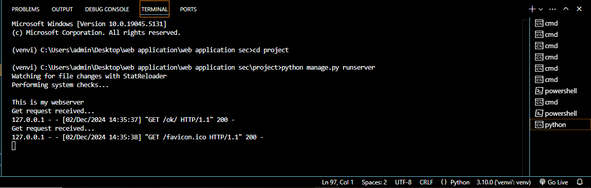

# EX01 Developing a Simple Webserver

# Date:07-10-2024
# AIM:
To develop a simple webserver to serve html pages and display the configuration details of laptop.

# DESIGN STEPS:
## Step 1:
HTML content creation.

## Step 2:
Design of webserver workflow.

## Step 3:
Implementation using Python code.

## Step 4:
Serving the HTML pages.

## Step 5:
Testing the webserver.

# PROGRAM:
```
from django.shortcuts import render, HttpResponse
from http.server import HTTPServer,BaseHTTPRequestHandler
content='''

<!DOCTYPE html>
<html lang="en">
<head>
    <meta charset="UTF-8">
    <meta name="viewport" content="width=device-width, initial-scale=1.0">
    <meta http-equiv="X-UA-Compatible" content="ie=edge">
    <title>System Specifications</title>
    <style>
      body {
        font-family: Arial, sans-serif;
        margin: 0;
        padding: 20px;
        background-color:darkgrey;
      }
      h1 {
        text-align: center;
        color: #2c2b2b;
      }
      table {
        width: 100%;
        max-width: 1200px;
        margin: 10px auto;
        border-collapse: collapse;
        box-shadow: darkseagreen;
            
      }
      th, td {
        padding: 12px;
        text-align: left;
        border-bottom: 1px solid #ddd;
      }
      th {
        background-color:darkseagreen;
        font-weight: bold;
      }
      td {
        color:grey;
        background-color:whitesmoke;
      }
    </style>
</head>
<body>

    <h1>Device Specifications</h1>
    
    <table>
      <tr>
        <th>Device Name</th>
        <td>DESKTOP-LNNG21I</td>
      </tr>
      <tr>
        <th>Processor</th>          
        <td>Intel(R) Core(TM) i5-7300U CPU @ 2.60GHz   2.71 GHz</td>
      </tr>
      <tr>
        <th>Installed RAM</th>
        <td>8.00 GB (7.86 GB usable)</td>
      </tr>
      <tr>
        <th>Device ID</th>
        <td>75100783-BDA3-45E2-908C-617CB55910EE</td>
      </tr>
      <tr>
        <th>Product ID</th>
        <td>00342-42709-07179-AAOEM</td>
      </tr>
      <tr>
        <th>System Type</th>
        <td>64-bit operating system, x64-based processor</td>
      </tr>
      <tr>
        <th>Pen and Touch</th>
        <td>No pen or touch input is available for this display</td>
      </tr>

      <tr>
        <th>Additional Information</th>
        <td>The system is equipped with a 13th Gen Intel Core i5 processor, providing a solid balance of power and efficiency for everyday tasks. The 16 GB of RAM ensures smooth multitasking performance, while the 64-bit architecture supports modern applications and games.</td>
      </tr>
    </table>
</body>
</html>
'''


class Myserver(BaseHTTPRequestHandler):
    def do_GET(self):
        print("Get request received...")
        self.send_response(200)
        self.send_header("content-type","text/html")
        self.end_headers()
        self.wfile.write(content.encode())
print("This is my webserver")
serveraddress = ('',8002)
httpd=HTTPServer(serveraddress,Myserver)
httpd.serve_forever()

```

# OUTPUT:




# RESULT:
The program for implementing simple webserver is executed successfully.
